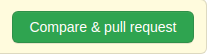
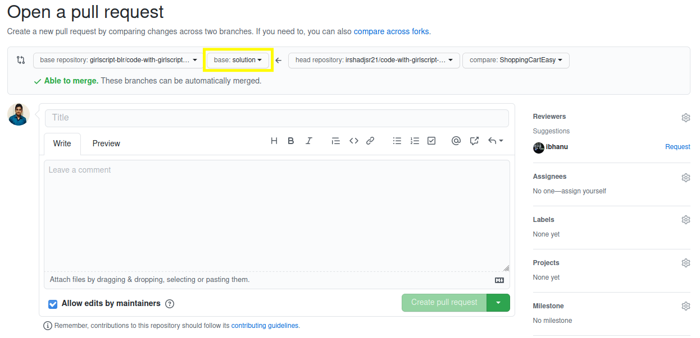

# Contributing to CodeWithGirlscriptBangalore

## Follow the steps below to get started right away!

- **Fork this repo**: You'll see a Fork button on the top right against the name of this repository. This creates an identical copy of this repository and adds it to your repositories.

- **Open the forked repository**: Navigate to your profile find the repository

  `github.com/<your_github_username>/code-with-girlscript-bangalore`

- **Clone the repository**: Clone the repository by copying the clone link (find it against the name of the repository on the right) and using it as mentioned in below CLI command

  `git clone https://github.com/<your-username>/code-with-girlscript-bangalore`
  
- **Move to the directory**: Move to the directory by using the below CLI command
 
  `cd code-with-girlscript-bangalore`

- **Create a new branch**: Follow proper naming convention before creating your own branch. The example of the naming is as follows

    - **Example**: If you want to create a pull request in the Shopping Cart Problem - Easy, your branch name can be `ShoppingCartEasy`.
    
  Now, execute the following command to create your own branch
  
    `git checkout -b <your-branch-name>`

- **Update the changes to repo**: Add your solution in the new branch. The solution must be in a specified format. Your code should be inside the SOLUTIONS folder of the respective problem statement. The codes/files should be inside a single folder following specific naming convention. The solution folder name should be `<your GitHub Id>_<your name>`.
  - Root Folder
    - Problem Statement
      - Solutions
        - `<Your solution folder>`
- **To stage the file(s)** , use the following CLI command

  `git add .`

- **Commit the file(s)**: For locally cloned repository, use the following CLI command to commit your file(s).

  `git commit -m "<your-message>"`

  For GitHub web, simply add the commit message and description at the bottom of the page to add the new file.(Please use an appropriate commit message and follow this git commit message guidelines)
  
- **Push the file(s)**: For locally cloned repository, use the following CLI command to push your file(s).

  `git push -u origin <you-branch>`.

- **Create pull request**: Please create a Pull Request(PR) from GitHub to the `solutions` branch. If you are new to creating pull requests, watch the video for reference. [Your First GitHub Pull Request (in 10 Mins)](https://www.youtube.com/watch?v=dSl_qnWO104)

  For GitHub web, simply move over to the original repository and click on New Pull Request and compare forked repositories. Provide appropriate description and VOILA!

  

  

- **PR Review**: Once you have created the PR, it will be reviewed soon by the maintainers of the repository

  - [Yajushi Srivastava](https://github.com/yajushiSri)
  - [Bhanu Pratap](https://github.com/ibhanu)
  - [Yati Padia](https://github.com/yati1998)
  - [Irshad Ansari](https://github.com/irshadjsr21)

If there are any changes suggested by the reviewers, do make the same and follow to steps to update:

- stage the changes, using command: `git add .`.
- commit the changes, using command: `git commit -m "Commit Message"`.
- rebase the branch, using command: `git rebase master`.
- squash the commits, using command: `git stash`.
- push the changes, using command: `git push -u origin <your-branch-name>`.

The PR with correct and optimised solution, which satisfies the deadline criteria, will be merged soon😄

> If you have successfully followed these steps, you're one step closer to being a **NEOPHYTE**, **EXPLORER** or **AFICIONADO**.🥳 But don't stop, continue making contributions and improve your chances every month!
> Let's build a strong community of kind developers! 👭👫👬

To know more about the program and it's guidelines do check [README.md](README.md) file.

A gentle reminder if you still haven’t filled our [participation form](https://tinyurl.com/codewithgsblr) 📃, fill it now😀.

Also,we love your input! We want to make contributing to this project as easy and transparent as possible. When contributing to this repository, please discuss the queries you have via issue or [email](mailto:girlscriptblr@gmail.com), with the maintainers of this repository to successfully complete the tasks.

- [Yajushi Srivastava](https://github.com/yajushiSri)
- [Bhanu Pratap](https://github.com/ibhanu)
- [Yati Padia](https://github.com/yati1998)
- [Irshad Ansari](https://github.com/irshadjsr21)

That's it! Thank you for your contribution! 😃
