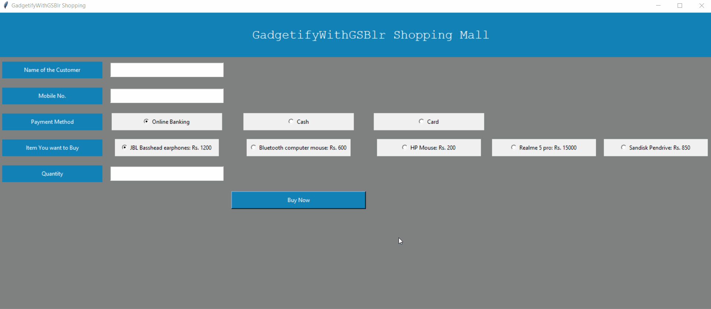
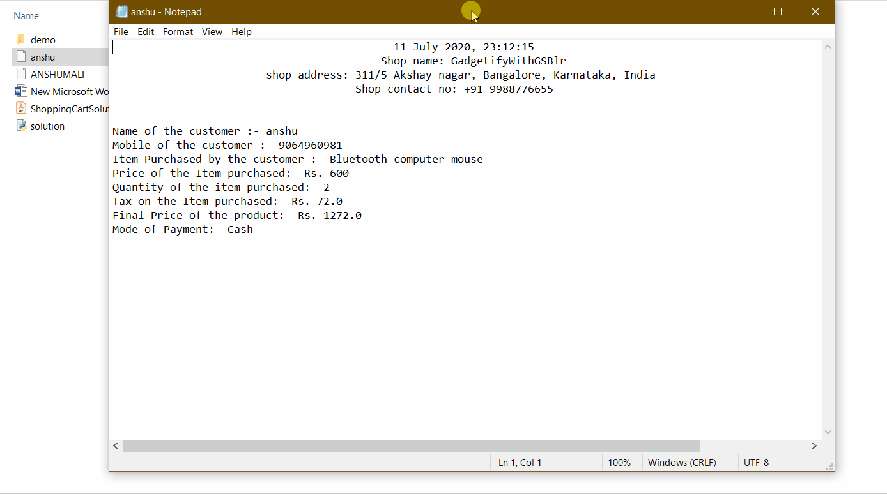

# Gadetify With GSBNGLR Shopping Mall

## Usage
### Generate Bill

### Generated Bill View

# Approach

- A simple python form for inputting customer's choices is generated using the python inbuilt GUI  **`tkinter`**
- Once the user submits the form, the function **`gen_bill`** calculates total bill according to the given criteria in the problem statement.
- Bill is generated as **`.txt`** file with the file name being the first name of the customer and stored in the same directly.
