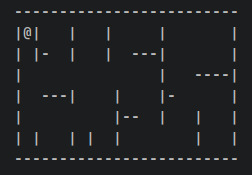

# Pacman Game - Easy

> Date : 1st August 2020

## Prerequisites
- Basic data manipulation in two dimentional array / matrix.
  - https://beginnersbook.com/2014/01/2d-arrays-in-c-example
- How to use keyboard's arrow keys as input.
  - For C/C++:
    - https://www.researchgate.net/post/How_to_use_arrow_keys_in_c_programming_language
    - http://cprogrampracticals.blogspot.com/2016/04/c-program-to-use-arrow-keys.html
  - For Python:
    - https://pythonhosted.org/pynput/keyboard.html
    - https://www.geeksforgeeks.org/python-drawing-design-using-arrow-keys-in-pygame/
  - for JavaScript:
    - https://www.geeksforgeeks.org/javascript-detecting-the-pressed-arrow-key/

## Problem Statement

All of us would have played the famous ‘PACMAN GAME’ in our childhood. 😃 The time has come to write code 👨‍💻👩‍💻 for the same!
The objective of the problem is to allow the Pacman to move along the walls of the maze. The code written should satisfy the requirements given below.

- Create a static 2D array that will represent a maze. There should be 3 types of characters stored in the 2D array.
  - One will represent a horizontal wall. (Ex: ‘-’)
  - One will represent a vertical wall. (Ex: ‘|’)
  - One will represent blank space. (Ex: ‘ ’)
  - One to represent the Pacman. (Ex: ‘@’)
  - Example   

- The 2D array must have a minimum of 10 rows and 40 columns.
- When the app runs, the 2D maze should be displayed along with the horizontal & vertical walls, blank space, and the Pacman.
- When the arrow keys are pressed the Pacman should move in the respective direction. (The Pacman obviously cannot move through the walls)

### Inputs

The user should be able to control the pacman with arrow keys, or (W,A,S,D).

### Output

The maze should be displayed on the screen and the player should be able to control the pacman.

## Requirements for submission

- A document containing a screenshot showing the results must also be pushed along with final submission. A brief description(not more than 4-5 lines/100 words) should be included containing the approach used for solving the problem.
- Last Submission Date : `30th August 2020`
- If you haven’t filled our [participation form](https://tinyurl.com/codewithgsblr) 📃yet, fill it now.

## How to submit solution?

Follow the steps mentioned in [this](../../CONTRIBUTING.md) file to submit your solution.

## Next steps

Solved this problem? Then you might want to checkout the other versions of this problem.

- [Medium](../../Medium/2.%20Pacman%20Game/README.md)
- [Hard](../../Hard/2.%20Pacman%20Game/README.md)
