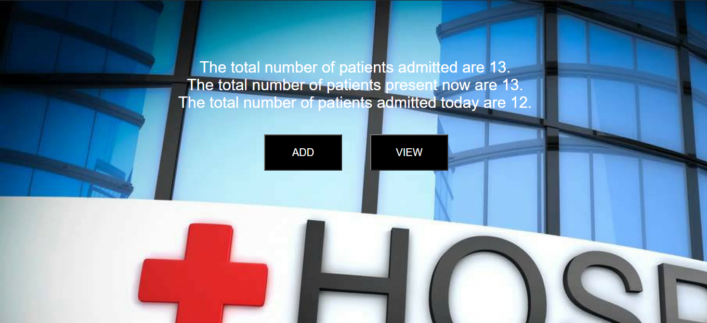

Instructions to run the application:

```
*Import the .sql file into XAMPP software which has database.
*Run index.php by typing loaclhost/index.php on your browser.
*To add the new patient details click on ADD button and click submit after entering all the details.
*To view the patient details click on VIEW button.
```
Application also outputs:

```
*The  total number of patients admitted on current date.

*Total number of patients present at current time.
```
The index.php looks like this:


Clicking ADD button will take you to Patients_add.php


Clicking VIEW button will take you to patients_view.php
