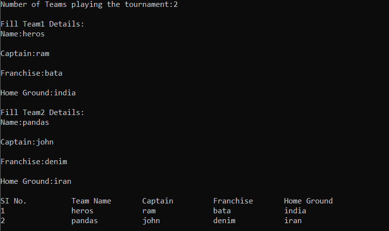

I have added the solution to the given problem statement IPL Management App (Easy). 
I have written the code in C++. The code uses the array data structures to store the data. 
As I input the details of the Team, the name, captain, franchise and Home ground. 
As soon as type the input I get the details displayed on screen.

