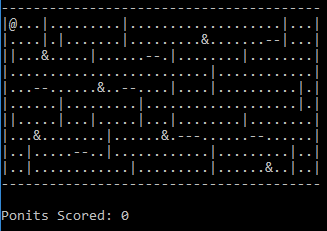

# Pacman Game - Medium

> Date : 1st August 2020

## Prerequisites

## Problem Statement

All of us would have played the famous ‘PACMAN GAME’ in our childhood. 😃 The time has come to write code 👨‍💻👩‍💻 for the same!
The objective of the problem is to allow the Pacman to move along the walls of the maze.
In this section, the Pacman needs to collect the ‘points’ as it moves in the maze. The pacman will also have the ‘ghost’ as its opponent. A final score needs to be displayed based on the number of points the Pacman was able to collect. The code written should satisfy the requirements given below.

- Create a static 2D array that will represent a maze. There should be 3 types of characters stored in the 2D array.
  - One will represent a horizontal wall. (Ex: ‘-’)
  - One will represent a vertical wall. (Ex: ‘|’)
  - One will represent blank space. (Ex: ‘ ’)
  - One to represent the Pacman. (Ex: ‘@’)
  - Character to represent points that Pacman can collect. (Ex: ‘.’)
  - One to represent a ghost. (Ex: ‘&’)
  - Example   

- The 2D array must have a minimum of 10 rows and 40 columns.
- When the app runs, the 2D maze should be displayed along with the horizontal & vertical walls, blank space, points, ghosts and the Pacman.
- When the arrow keys are pressed the Pacman should move in the respective direction. (The Pacman obviously cannot move through the walls)
- The initial score should be zero and displayed at the bottom or top of the maze (outside the maze). 
- When the Pacman lands on a point character, the point character should be removed and 5 points should be added to the player score.
- The ghost should move automatically. The movement algorithm can be created by considering the following points:
  - The ghost should start moving in a random direction (left, right, up or down) and continue to move until it hits a wall.
  - After hitting the wall the direction of movement of that ghost should reverse.
- When the pacman collides with the ghost, the game should end.
- The game should end after all the points have been collected.

### Inputs

The user should be able to control the pacman with arrow keys, or (W,A,S,D).

### Output

The maze should be displayed on the screen and the player should be able to control the pacman.

## Requirements for submission

- A document containing a screenshot showing the results must also be pushed along with final submission. A brief description(not more than 4-5 lines/100 words) should be included containing the approach used for solving the problem.
- Last Submission Date : `30th August 2020`
- If you haven’t filled our [participation form](https://tinyurl.com/codewithgsblr) 📃yet, fill it now.

## How to submit solution?

Follow the steps mentioned in [this](../../CONTRIBUTING.md) file to submit your solution.

## Stuck somewhere?

Then you might want to solve these versions of the problem first.

- [Easy](../../Easy/2.%20Pacman%20Game/README.md)

## Next steps

Solved this problem? Then you might want to checkout the other versions of this problem.

- [Hard](../../Hard/2.%20Pacman%20Game/README.md)
