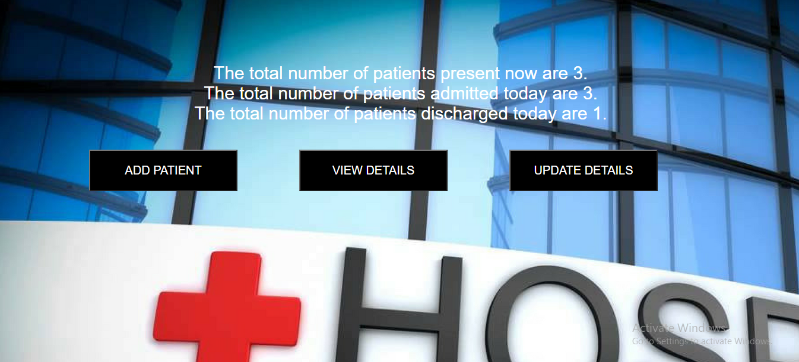
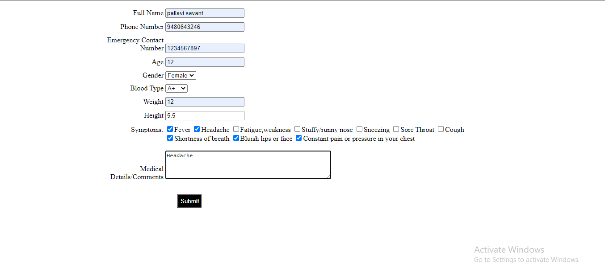
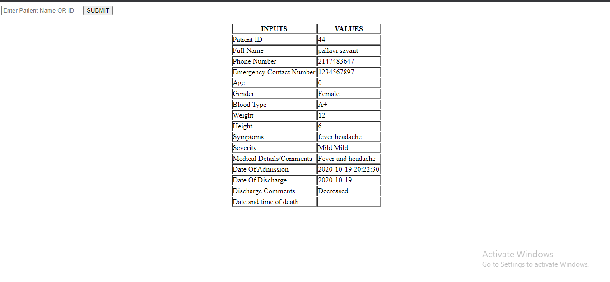
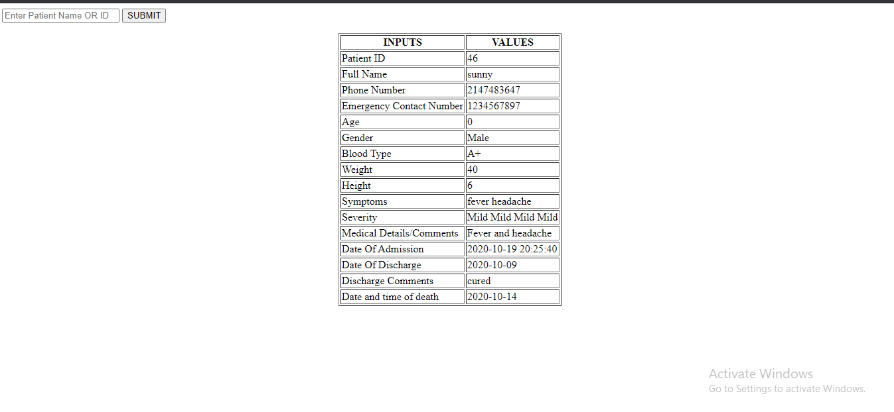
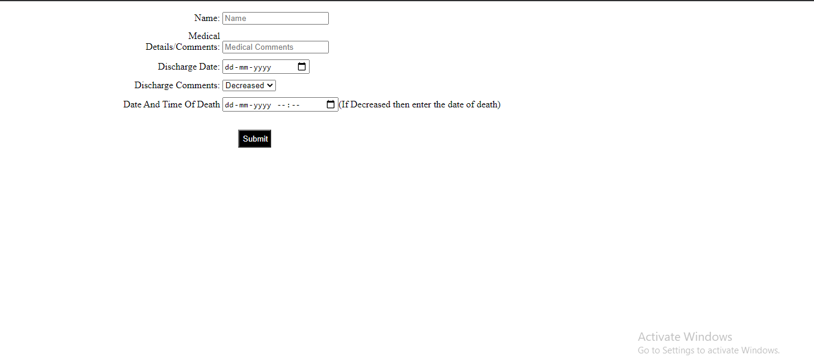

Instructions to run the application:

```
*Import the .sql file into XAMPP software which has database.
*Run index.php by typing loaclhost/index.php on your browser.
*To add the new patient details click on ADD PATIENTS button and click submit after entering all the details.
*To view the patient details click on VIEW DETAILS button then you can enter particular patients name/ID to get their respective details.
*To update patient details click on UPDATE DETAILS button and enter details and click on submit,then you can view the updated details by clicking VIEW DETAILS button.
```
Application also outputs the below details on dashboard page(index.php):

```
*The  total number of patients admitted on current date.
*Total number of patients present at current time.
*The total number of patients discharged on current date.
```
The index.php looks like this:


Clicking ADD button will take you to Patients_add.php


Clicking VIEW button will take you to patients_view.php(This is details of cured patient)


Details of disease decreased patient


Update details page looks like this
